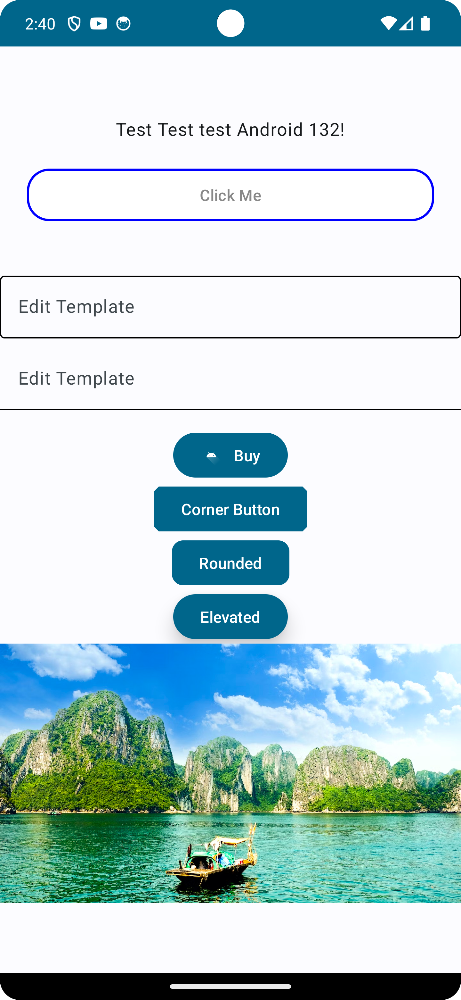
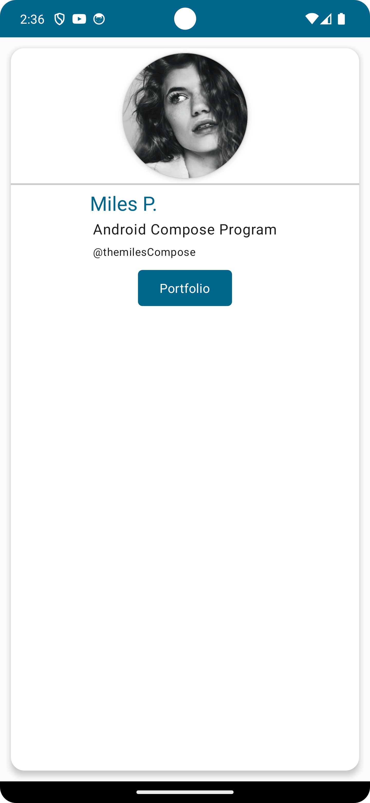

## App List

### Android 13 Fundamentals
Material Source: [Morden Android 13 Development Cookbook](https://github.com/PacktPublishing/Modern-Android-13-Development-Cookbook)
> /Android13Fundamentals

#### Screenshots

    
    
    
    
    

### Simple Weather App
> /WeatherApp

#### Screenshots

    =

### Simple Card
Material Source: [Android Jetpack Compose - Build Android Native UIs Fast](https://github.com/PacktPublishing/Android-Jetpack-Compose---Build-Android-Native-UI-s-Fast)
> /SimpleCard

#### Screenshots

    =

### User Board
Video Tutorial: [UI Lover Youtube](https://www.youtube.com/watch?v=g3xWo0cLszE)
> /UserBoard

#### Screenshots

    
    
    
    
    

### Second Weather App
Video Tutorial: [UI Lover Youtube](https://www.youtube.com/watch?v=z72ChtkbnfA&t=2028s)
> /SecondWeatherApp

#### Screenshots

    
    

### Jetpack Compose Login Form
Video Tutorial: [UI Lover Youtube](https://youtu.be/4tVm0fsj5PU?si=wQ9uDJzc2dwzHN4N)
> /JetpackComposeLogin

#### Screenshots

    

